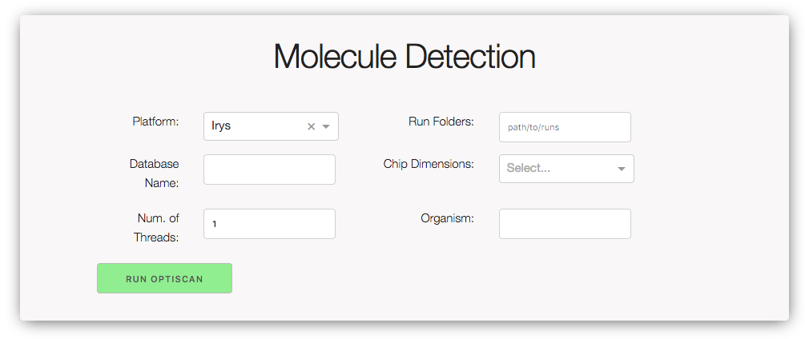
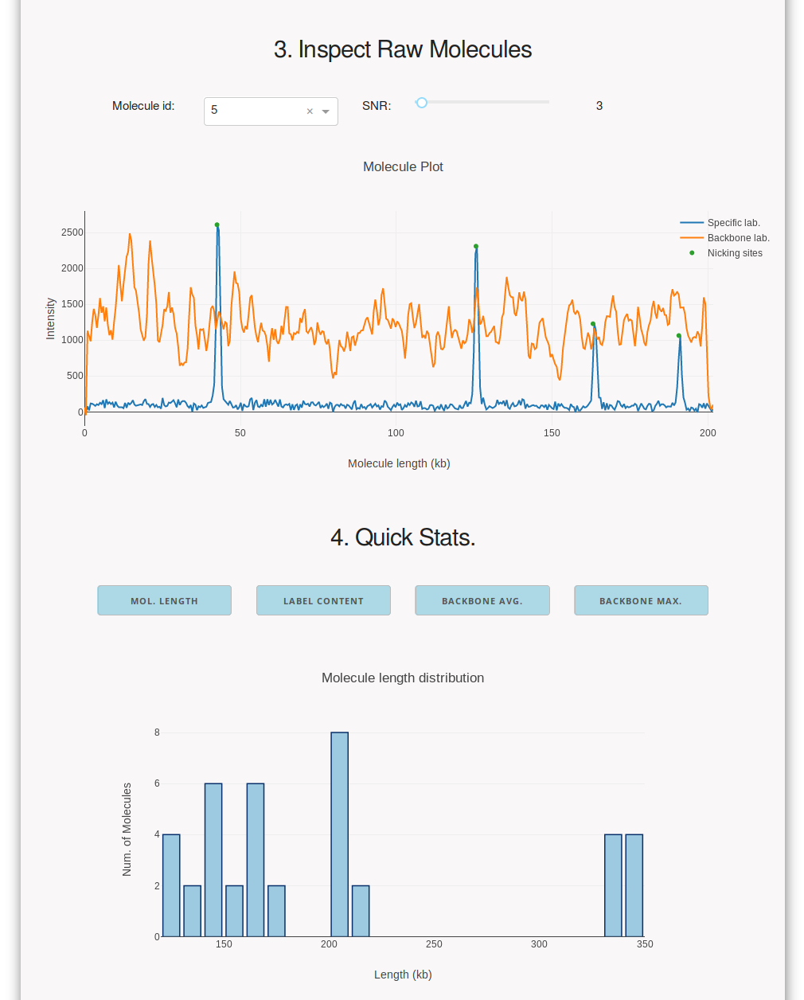

# OptiScan Tool

OptiScan is an open source tool for extraction of nick and backbone signals
from provided Bionano Genomics optical map TIFF images. OptiScan is able to
transform nick signals into nicking site coordinates and output these in
the BNX format for further processing.


## Requirements

* **`Python >=3.6`** 
* **`sqlite`**

## Installation

```bash
git clone https://gitlab.com/akdel/OptiScan.git
cd OptiScan
pip install . --user
```

## Usage - Dashboard
OptiScan dashboard is only available for Irys platform. See command-line version for Saphyr data.

1. Run the http server with permitting external access (or use `--ip=localhost` for local access) and a desired port:
    ```bash
    optiscan_dashboard --ip=0.0.0.0 --port=8080
    ```
2. Access it from a browser at `http://0.0.0.0:8080/optiscan` (or `http://localhost:8080/optiscan`).

### Running from OptiScan dashboard

While ordinarily OptiScan is best used from the command line, a dashboard is also available. 
 It is built as a web application with 
[`Dash`](https://github.com/plotly/dash).  In this interface, you can
execute molecule detection/extraction and inspect the raw molecules and
molecule length distributions.  Inspecting these values supports the choice
of SNR, maximum DNA backbone intensity and minimum molecule length
thresholds prior to exporting the data in the BNX format.

#### Using dashboard with test data

You can find two scan image files in the directory `data/test_run/` and specify this 
path in the dashboard under **Run Folders**.

Providing all the test parameters in **Molecule detection** section and
running OptiScan is required to extract molecules and create the test
database.  Test parameters are already filled (except the database name) when
the dashboard is launched.  Molecules in the test data can be simply
detected by entering a database name and clicking **RUN OPTISCAN**.  This
process can take up to 5-10 minutes to complete, depending on your 
workstation speed.

You can find the live demonstration of OptiScan dashboard at [http://bioinformatics.nl/optiscan/](http://bioinformatics.nl/optiscan/). (note: the demo interface lacks the molecule detection function.)

#### Dashboard screenshots


Molecule detection


Molecule inspection

### Usage - Command-line Interface
The `optiscan/pipelines/` folder contains several scripts for running OptiScan with Irys or Saphyr data.

1. `extract_molecules_irys` and `extract_molecules_saphyr` are for extracting and recording optical map signals. (Details on parameters and usage are given with cli `--help`)
    example usage:
    
    ```bash
   extract_molecules_irys '/path/to/run1,/path/to/run/2' '12,95' --database_name=data.db --number_of_threads=10
   extract_molecules_saphyr '/path/to/saphyr_data' --number_of_threads=10
    ```
   Usage with test data:
   Test data scans are reduced in dimension to 12x1 frames. To run the test data, simply provide `"12,1"` as `--chip_dimension`:
   
   ```bash
   extract_molecules_irys 'data/test_run' '12,1' --database_name=test.db --number_of_threads=10
   ```
   
2. `write_bnx_irys` and `write_bnx_saphyr` are for writing extracted molecules in the BNX format. (Details on parameters and usage are given with cli `--help`)
    
    example usage:
    ```bash
   write_bnx_irys /path/to/apple.db --snr=3
   write_bnx_saphyr /path/to/saphyr_data --snr=3
    ```
## CLI commands for test data:

Test data scans are reduced in dimension to 12x1 frames. To run the test data, simply provide `"12,1"` as `--chip_dimension`:

```

```